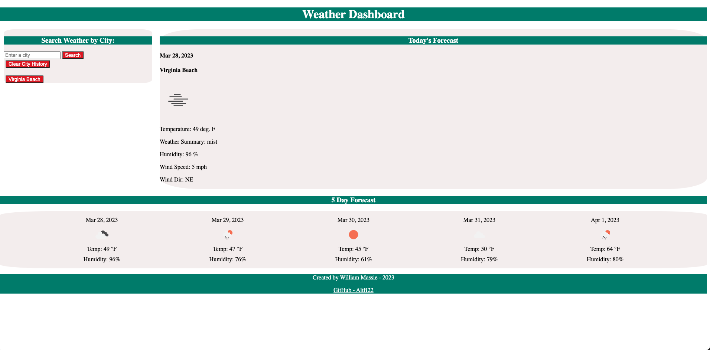

# Weather_Dashboard

## Description
This is a basic weather application that features a current as well as five day forecast.  The user can enter any city and search for weather conditions.  In addition, for each city searched, a button with the city name will persist via local storage and have the ability to recall that city's weather data.  The user can clear the local storage data and corresponding buttons with the "Clear City History" Button.  The Application in the users browser and uses JavaScript to dynamically update HTML content and CSS styling.

## User Story
- AS A traveler
- I WANT to see the weather outlook for multiple cities
- SO THAT I can plan a trip accordingly

## Acceptance Criteria
- GIVEN a weather dashboard with form inputs
- WHEN I search for a city
- THEN I am presented with current and future conditions for that city and that city is added to the search history
- WHEN I view current weather conditions for that city
- THEN I am presented with the city name, the date, an icon representation of weather conditions, the temperature, the humidity, and the the wind speed
- WHEN I view future weather conditions for that city
- THEN I am presented with a 5-day forecast that displays the date, an icon representation of weather conditions, the temperature, the wind speed, and the humidity
- WHEN I click on a city in the search history
- THEN I am again presented with current and future conditions for that city

## Screenshot and Link to Deployed Application

https://altb22.github.io/Weather_Dashboard/

## License

MIT License

Copyright (c) 2022 William Massie

Permission is hereby granted, free of charge, to any person obtaining a copy
of this software and associated documentation files (the "Software"), to deal
in the Software without restriction, including without limitation the rights
to use, copy, modify, merge, publish, distribute, sublicense, and/or sell
copies of the Software, and to permit persons to whom the Software is
furnished to do so, subject to the following conditions:

The above copyright notice and this permission notice shall be included in all
copies or substantial portions of the Software.

THE SOFTWARE IS PROVIDED "AS IS", WITHOUT WARRANTY OF ANY KIND, EXPRESS OR
IMPLIED, INCLUDING BUT NOT LIMITED TO THE WARRANTIES OF MERCHANTABILITY,
FITNESS FOR A PARTICULAR PURPOSE AND NONINFRINGEMENT. IN NO EVENT SHALL THE
AUTHORS OR COPYRIGHT HOLDERS BE LIABLE FOR ANY CLAIM, DAMAGES OR OTHER
LIABILITY, WHETHER IN AN ACTION OF CONTRACT, TORT OR OTHERWISE, ARISING FROM,
OUT OF OR IN CONNECTION WITH THE SOFTWARE OR THE USE OR OTHER DEALINGS IN THE
SOFTWARE.
